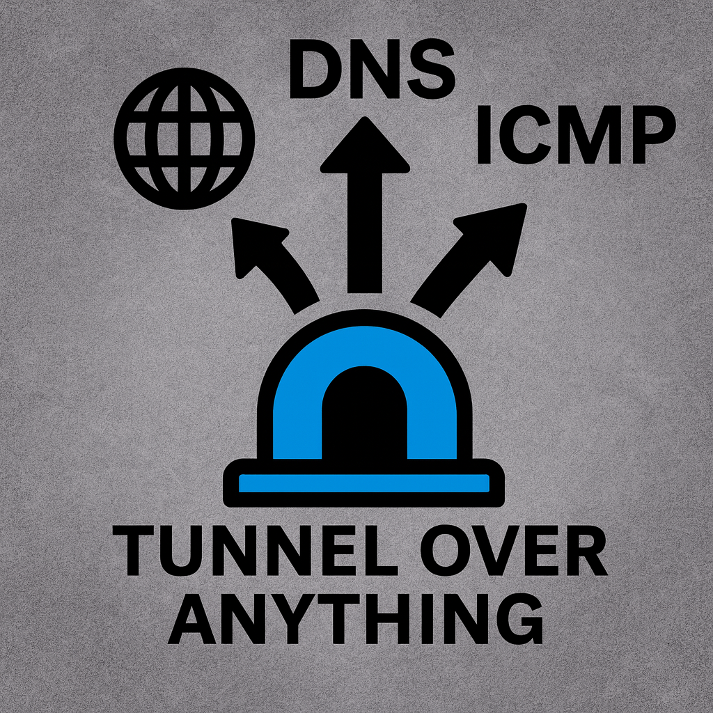

# Tunnel over Anything

> [!CAUTION]
> THIS TOOL IS FOR AUTHORIZED TESTING AND RESEARCH PURPOSES ONLY<br>
> UNAUTHORIZED USE OF THIS TOOL MAY CONSTITUTE A CRIME

Tunnel over Anything (ToA) is an experimental end-to-end tunneling program that disguises TCP/UDP traffic as legitimate network protocols such as DNS, HTTP, or even ICMP (ping) to evade IDS/IPS detection or escape captive portal firewalls.

Supported Transports:<br>
- ✅ UDP<br>
- ⏳ TCP (planned)<br>

Obfuscation methods:<br>
- ✅ None (raw relay mode)
- ✅ DNS
- ⏳ HTTP/HTTPS (planned)
- ⏳ ICMP Ping (planned)

## How It Works

To transmit obfuscated data over a network, two instances of Tunnel over Anything (ToA) are required. At least one node must operate in server mode with a publicly accessible port to accept incoming connections. The other node runs in client mode, initiating the connection to the server.


### Server Mode:

In server mode, ToA expects to receive encoded packets on its listening port, disassemble the data and transmit it via the client connector.

Generally the server connector will be public-facing, whereas the client connector will point to a local service.

[Example client config](docs/client_side_config.toml)
```
                   [ ------------- Tunnel over Anything --------------]
encoded packets -> server connector -> disassembler -> client connector -> raw data
encoded packets <- server connector <-   assembler  <- client connector <- raw data
```
### Client Mode

In client mode, ToA expects to receive raw packets on it's listening port, assemble the data and transmit it via the client connector.

Generally the server connector will be internally facing, whereas the client connector will point to a public IP.

[Example server config](docs/server_side_config.toml)
```
                   [ ------------- Tunnel over Anything --------------]
       raw data -> server connector ->   assembler  -> client connector -> encoded data
       raw data <- server connector <- disassembler <- client connector <- encoded data
```

### Run via Docker (experimental)
```
docker run \
    -v path/to/config.toml:/tunnel_over_anything/config.toml \
    -p <host_port>:<container_port> \
    --restart unless-stopped \
    -d \
    tunnel_over_anything:latest
```

### Run via Python (stable)
#### Run on Linux
```
python -m venv .venv
source .venv/bin/activate
pip install .
python main.py
```
#### Run on Windows
```
python -m venv .venv
.\.venv\Scripts\activate.ps1
pip install .
python main.py
```

### Compile and Run via Nuitka (Recommended)

Nuitka is a python compiler that simplifies deployment of ToA and substantially improves performance

#### Build Executable
```
pip install Nuitka

# Windows install
python -m nuitka main.py --onefile --standalone --windows-icon-from-ico=docs/tunnel_over_anything.ico --output-filename=tunnel_over_anything.exe

# Linux install
python -m nuitka main.py --onefile --standalone --linux-icon=docs/tunnel_over_anything.ico --output-filename=tunnel_over_anything.bin
```

#### Run Executable

```
# Windows
./tunnel_over_anything.exe

# Linux
./tunnel_over_anything.bin
```
Note: Nuitka-compiled executables may trigger antivirus/Windows Defender alerts, and will likely need to be whitelisted.